[`EMPEROR`](https://astroemperor.readthedocs.io/en/latest) (Exoplanet Mcmc Parallel tEmpering for Rv Orbit Retrieval), is an open-source Python-based framework designed for the efficient detection and characterisation of exoplanets by using radial velocity (RV) methods and astrometry.

Its combination of performance, flexibility, and ease of use makes it a robust tool for any exoplanet detection endeavour. `EMPEROR` integrates Dynamic Nested Sampling (DNS) and Adaptive Parallel Tempering (APT) Markov Chain Monte Carlo (MCMC), supporting multiple noise models such as Gaussian Processes (GPs) and Moving Averages (MA). The framework facilitates systematic model comparison using statistical metrics, including Bayesian evidence and Bayes Information Criterion (BIC), while providing automated, publish-ready visualisations.

The code is easy to install and easy to use, providing full publication-ready plots and copy-pastable latex tables:

```python

import astroemperor as emp
import numpy as np
np.random.seed(1234)

sim = emp.Simulation()
sim.load_data('51Peg')  # folder read from /datafiles/

sim.engine_config['setup'] = [10, 500, 3000, 1]  # ntemps, nwalkers, nsweeps, nsteps

sim.add_condition(['Period 1', 'limits', [3, 5]])  # short chain
```

Some Automatic Plots:
=== "Best Fit"
    Full model, and phase-folded per planet
    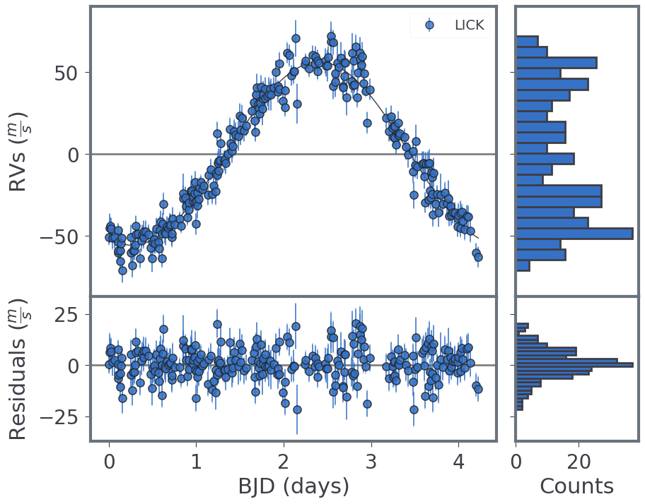
=== "Arviz: Trace and More"
    For every model block:
    === "Corner"
        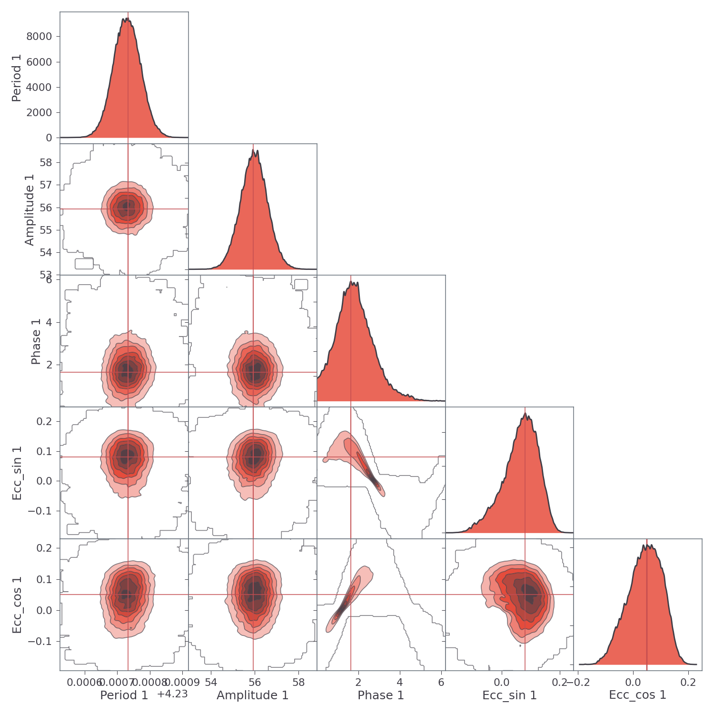
    === "Trace"
        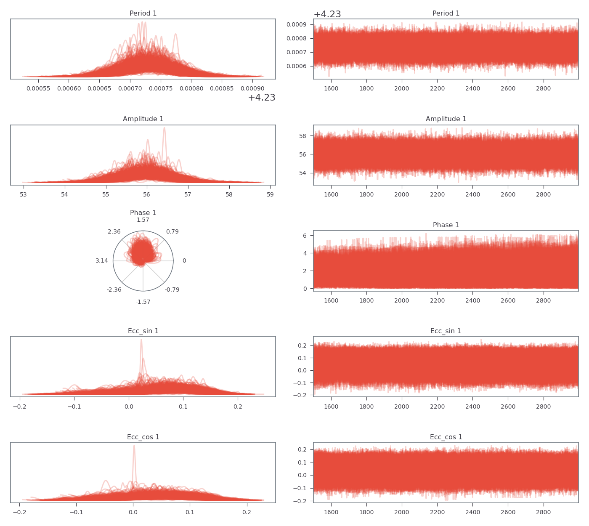
    === "HDI Intervals"
        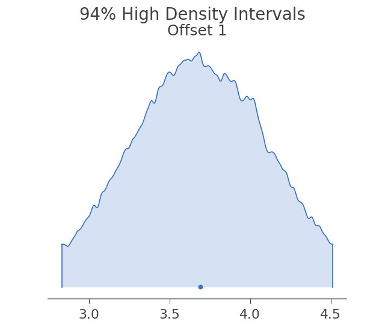
    === "Normalised Posteriors"
        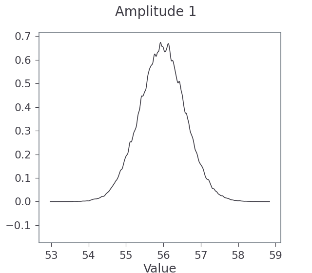


=== "Posteriors"
    For every model block, and temperature:
    === "Scatter"
        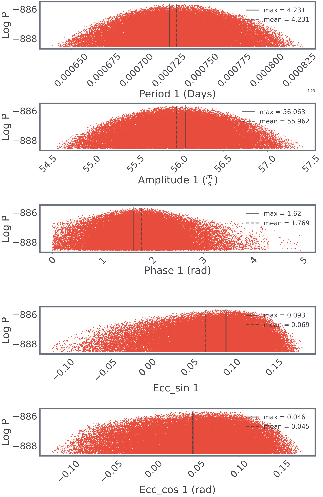
    === "Higher temperatures!"
        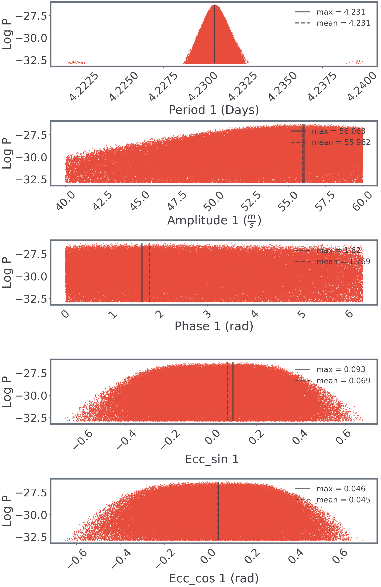
    === "Different styles 1"
        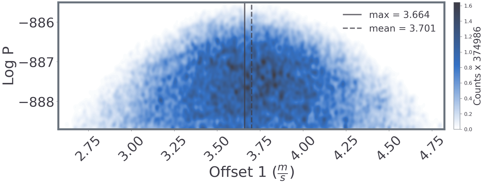
    === "Different styles 1"
        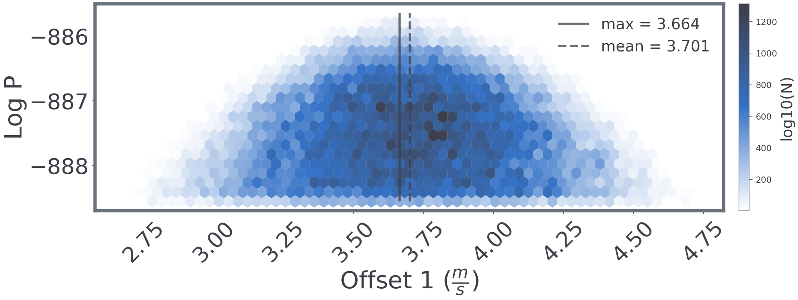
            
=== "Estimates"
    For every parameter:
    === "GME"
        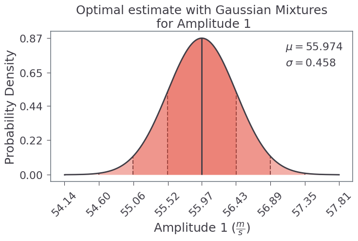
    === "Histograms"
        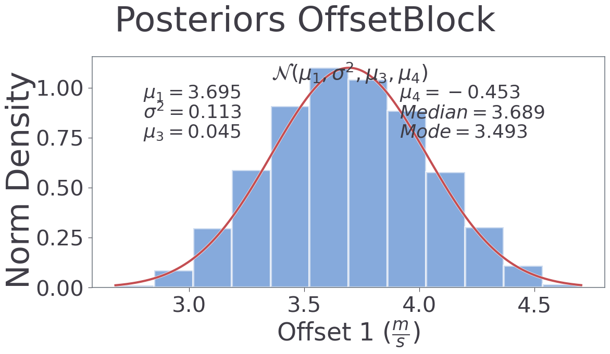


=== "Temperature Ladder"
    === "Swap Acceptance"
        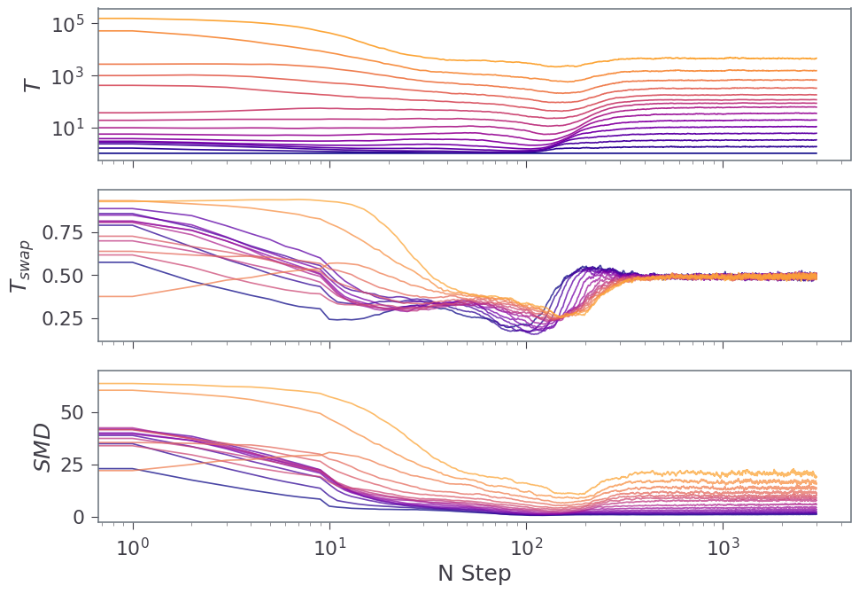
    === "Ladder"
        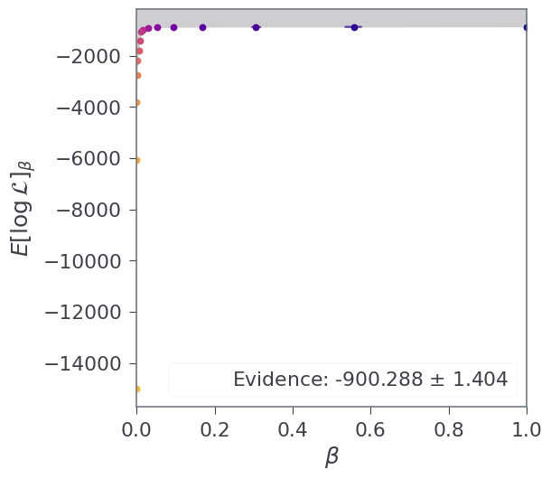
    === "Density"
        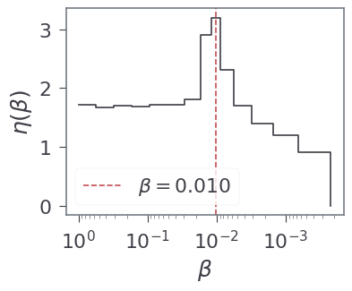
